<div align="center">

<picture>
  <source media="(prefers-color-scheme: dark)" srcset="docs/brand/hero-dark.svg">
  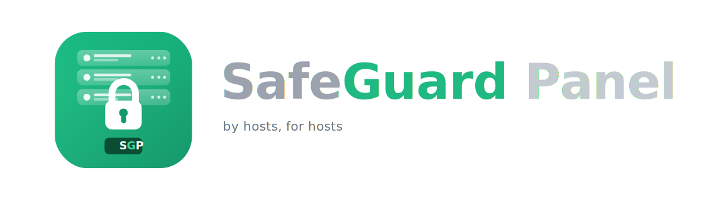
</picture>

### 🛡️ The modern web hosting control panel that's actually **free**

**Every feature. Unlimited servers. Unlimited accounts. $0. No gimmicks — ever.**

A complete cPanel / Plesk / DirectAdmin alternative: one self-contained Go binary,
a React control panel with **six switchable UI shells**, and a one-command installer
for AlmaLinux 9.

[](https://github.com/SafeGuard-Hosting/SafeGuard-Panel-CE/releases/latest)
[](#-licensing--actually-free-heres-exactly-how)
[](LICENSE)
[](#-tech-stack)
[](#-tech-stack)
[](#-install-on-almalinux-9)
[](SECURITY.md)

Fresh **AlmaLinux / Rocky / CloudLinux 9** box → working panel in minutes:

```sh
curl -sSL https://install.safeguardpanel.ca | sudo bash
```

<sub>Full install options, requirements and what the installer does: [Install guide ↓](#-install-on-almalinux-9)</sub>

[⚡ Performance](#-performance--built-in-2026-not-2003) ·
[🎨 Six UI shells](#-a-panel-that-adapts-to-your-workflow--not-the-other-way-around) ·
[⚔️ Comparison](#%EF%B8%8F-how-it-compares) ·
[🔒 Security](#-security) ·
[🚀 Install](#-install-on-almalinux-9) ·
[🧾 License](#-licensing--actually-free-heres-exactly-how) ·
[❓ FAQ](#-faq) ·
[🗺️ Roadmap](#%EF%B8%8F-roadmap)

</div>

---

## 🤝 Our promise — no gimmicks, no tricks

> **SafeGuard Panel is free. The whole panel.** Every feature, unlimited domains,
> unlimited accounts, unlimited resellers — on as many servers as you want.
> No expiring trial. No locked "premium" tier. No per-account pricing that creeps
> up every year. No "upgrade to unlock." No phone-home. No ads in your control panel.
>
> **The free version *is* the real version.** We make money one way: if you *choose*
> a support license or let us run your servers for you with managed hosting.
> We will never make money by crippling the product you self-host.
>
> **One boundary, stated up front:** free covers *using* the panel — personally
> or as a hosting company, reseller hosting included. **Selling or redistributing
> the panel itself** (bundling it, repackaging it, shipping it as your product)
> requires a license from us first: **support@safeguardpanel.ca**.
>
> **That's the promise, and we're not walking it back.**

---

## ✨ Why SafeGuard Panel?

The incumbents are 20+ years old. Their architecture shows it — sprawling Perl and
PHP codebases, dozens of daemons, heavy per-account license fees, and UIs that fight
you. SafeGuard Panel was built in 2026, security-first, as **one static Go binary**
and a modern React app:

| | |
|---|---|
| 🧱 **Zero-framework Go core** | `net/http` pattern router, **3 dependencies total**, one 13.5 MB static binary |
| ⚡ **Genuinely fast** | ~5,800 authenticated API req/s at p50 9 ms — [measured, not marketed](#-performance--built-in-2026-not-2003) |
| 🎨 **6 switchable UI shells** | cPanel, Plesk, DirectAdmin Evolution & Standard, HestiaCP, ISPConfig — all light + dark |
| 🏷️ **True white-label** | Per-reseller name, colors, every logo asset, favicon, SEO image — words *or* pictures, scalable logo |
| 👥 **Owner → Reseller → User RBAC** | Every query scoped; resellers see only their own subtree |
| 🔒 **Security-first** | CSF firewall, ImunifyAV/360 ⇄ Fail2Ban engine, ModSecurity WAF, 2FA, support keys, in-house pentested |
| 🌐 **Full hosting stack** | Nginx + Apache + PHP-FPM (7.4 → 8.5), BIND DNS, Let's Encrypt, FTP, Valkey, Varnish |
| 📧 **Mailbox-free by design** | No mail daemon on the panel box — pluggable SafeGuard Mail / Google / M365 / external |
| 🧰 **WordPress & CMS toolkits** | Plesk-class WP toolkit, Joomla/Drupal, 1-click installer, live site screenshots |
| 🖱️ **Wix-class website builder** | Drag-and-drop studio, 51 templates, ecommerce, blog, forms, bookings, memberships — included, not an add-on |
| 💳 **8 billing platforms** | WHMCS, Blesta, HostBill, ClientExec, FOSSBilling, BoxBilling, Paymenter, BillingServ — built in |
| ☁️ **Encrypted off-site backups** | Backblaze B2, AES-256-GCM, scheduled + selective restore |

### 👥 Who it's for

- **🏢 Hosting companies & resellers** — full Owner → Reseller → User hierarchy, true white-label, 8 billing integrations. Drop the per-account license tax.
- **🛠️ Agencies & freelancers** — host every client on one box, brand the panel as your own, hand clients a polished login.
- **👩‍💻 Developers & self-hosters** — one binary, one command, modern UI, Git + app hosting + the website builder. No license key, no nag.
- **🔁 Anyone migrating off cPanel/Plesk** — the built-in wizard imports from 10 panels; the six UI shells mean your team keeps its muscle memory.

---

## ⚡ Performance — built in 2026, not 2003

Legacy panels carry two decades of architecture. SafeGuard Panel is a single
compiled binary serving a static React bundle — and it shows up in the numbers.

### Measured (not marketing)

Run on a mid-range dev laptop over loopback, full production middleware active
(security headers, rate limiting, body limits) — production Linux builds are faster:

| Benchmark | Result |
|---|---|
| ⏱️ Cold start (process launch → first request served) | **~0.5 s** (avg 584 ms over 3 runs) |
| 🚀 API throughput (full security middleware) | **6,691 req/s** · p50 **7.9 ms** · p99 46 ms · 0 errors |
| 🔐 *Authenticated* API (JWT + session check + SQL query **per request**) | **5,812 req/s** · p50 **9.2 ms** · p99 52 ms · 0 errors |
| 🧊 Panel service CPU (idle) | **0.00%** — 0 ms of CPU over 10 s with no traffic |
| 💾 Panel service RAM (idle) | **~67 MB** |
| 💾 Panel service RAM (under 64-way load) | **~73 MB** |
| 📦 Panel binary (static, stripped) | **13.5 MB** |
| 🌐 First login page over the wire | **~300 KB gzipped** (95 lazy-loaded route chunks after that) |
| 🗄️ Dependencies in the entire backend | **3** (JWT, crypto, pure-Go SQLite) |

### 📈 Boot & footprint, charted

A single Go process is ready in half a second and barely moves off ~67 MB. A
classic panel stack spins up dozens of daemons and climbs to a gigabyte-plus
before it's fully up.

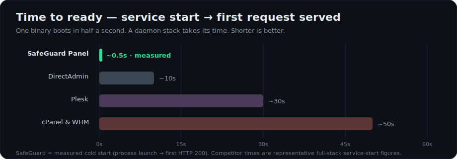

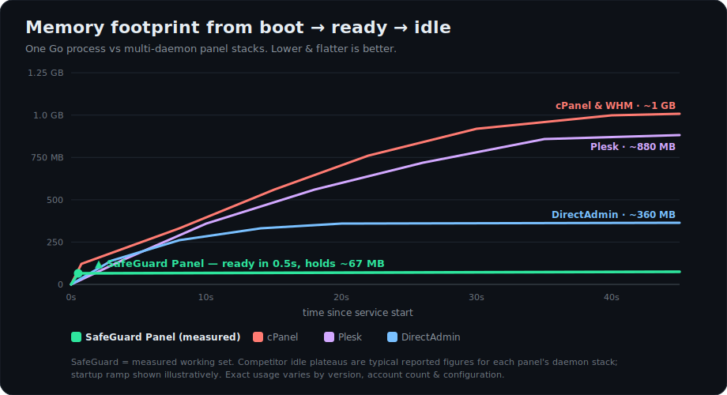

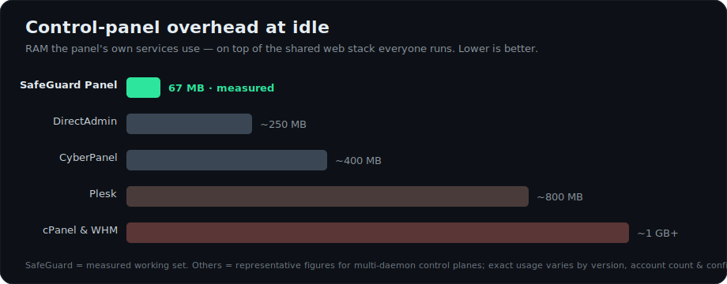

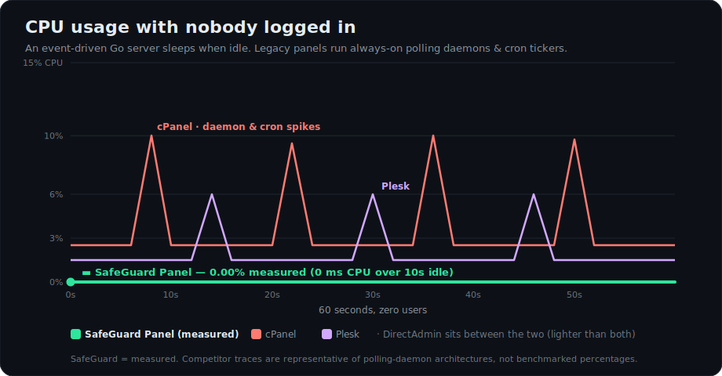

<sub>SafeGuard bars/curves are **measured** on the dev box (idle CPU was a literal
**0 ms over 10 s** — a single event-driven Go process does nothing when nobody
is logged in). Competitor curves are **illustrative**: no vendor publishes
idle-CPU figures, and their licenses prevent independent redistribution of
benchmarks, but their architectures run dozens of always-on daemons and
scheduled jobs (cPanel's `cpsrvd`/`queueprocd`/`tailwatchd` + nightly `upcp`,
Plesk's `sw-engine`/`psa` service family, DirectAdmin's `dataskq` minute-cron),
each of which wakes on a timer even with zero users. Their **RAM** baselines
are sourced where vendors publish them — see the requirements table below.</sub>

### 💸 …and it's free

Every legacy panel bills you per server (and usually per account on top). SafeGuard
Panel is **$0 at every scale, forever** — the savings are the easiest math in hosting:

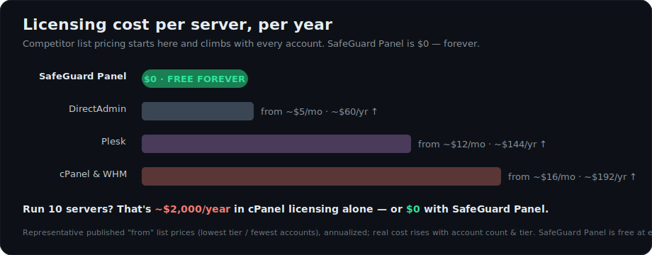

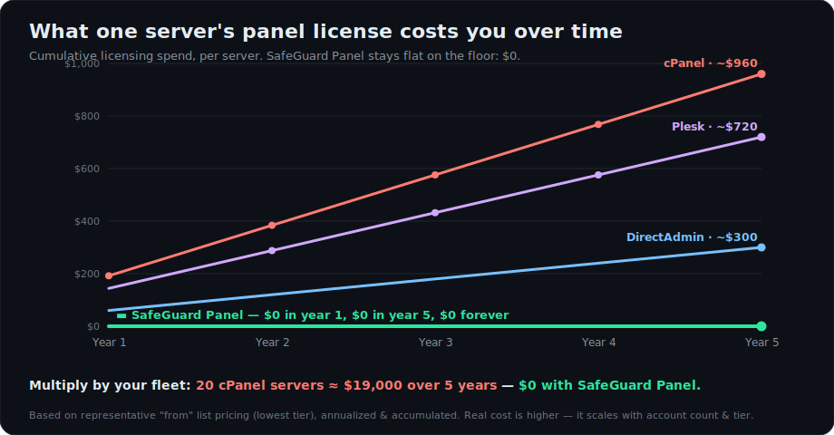

### What that means next to the incumbents

| | **SafeGuard Panel** | Legacy panels (cPanel / Plesk class) |
|---|---|---|
| Panel service footprint | **One process, ~67 MB** | Dozens of daemons, hundreds of MB before the first site |
| Install | **Minutes** — one command, prebuilt binaries | 15–60 min compiles & bootstraps |
| Update | Download binary → swap → restart (auto-rollback) | Multi-stage upcp/autoinstaller runs |
| Page loads | Static React app + JSON API, ~10 ms server time | Server-rendered templates, full page reloads |
| Disaster recovery | **Standalone repair server on :2085** — works even when the panel is down | SSH and pray |
| Dependency surface to audit | 3 Go modules | Thousands of Perl/PHP packages |

> *Throughput measured with 8,000 requests at 64-way concurrency across 200 simulated
> client IPs against `GET /api/health` and the authenticated, database-backed
> `GET /api/domains`. Every response was verified `200 OK` — rate-limited responses
> were excluded by design. Your hardware will vary; the architecture won't.*

### 📋 System requirements

The panel itself is a **13.5 MB binary that idles at ~67 MB RAM** — so the
minimums below are set by the OS and the shared web stack, *not* by SafeGuard.
That puts it at the **lightest tier**, beating cPanel and Plesk on disk and
matching the leanest panels on RAM:

| | vCPU (min / rec) | RAM (min / rec) | Disk (min / rec) |
|---|:---:|:---:|:---:|
| **🛡️ SafeGuard Panel** | **1 / 2** | **1 GB / 2 GB** | **10 GB / 20 GB** |
| cPanel & WHM | 1 / 2 | 2 GB / 4 GB¹ | 20 GB / 40 GB |
| Plesk | 1 / 2 | 1 GB² / 2 GB+ | 20 GB / 40 GB+ |
| DirectAdmin | 1 / 2 | **4 GB³** + 4 GB swap | 2 GB free³ |
| CloudPanel | 1 / 2 | 1 GB / 2 GB | 10 GB / 30 GB |

<sub>Figures are for the **panel + its base stack only** — no customer sites yet.
A single vCPU is plenty for the panel (it measured **0% idle CPU**); the second
core — like the extra RAM and disk — is headroom for customer workloads.
Competitor figures are the vendors' own published requirements (checked June 2026):
¹ [cPanel on AlmaLinux](https://docs.cpanel.net/installation-guide/system-requirements-almalinux/):
2 GB minimum / 4 GB recommended, +1 GB more if you add ClamAV.
² [Plesk Obsidian](https://docs.plesk.com/release-notes/obsidian/system-requirements/):
1 GB **plus a mandatory 1 GB swap** on Linux.
³ [DirectAdmin](https://docs.directadmin.com/getting-started/installation/system-requirements.html):
"a minimum 4 GB of memory is required, with at least 4 GB of swap"; disk is
2 GB free *excluding all site data*.
[CloudPanel](https://www.cloudpanel.io/docs/v2/getting-started/requirements/) ships its own figures.
SafeGuard's own panel service is ~67 MB of that — the rest is Nginx/Apache/PHP/DB,
which every panel runs.</sub>

> 💡 **The difference shows up as you grow.** cPanel and Plesk get heavier with
> every account (more daemons, more cron, more polling). SafeGuard's panel
> service stays at ~67 MB whether you host 1 site or 1,000 — so the RAM and disk
> you add go to *customer workloads*, not the panel. Budget extra only for what
> you actually run on top (busy sites, databases, or the optional Imunify360 +
> ClamAV agents, which want a few GB of their own).

---

## 🎨 A panel that adapts to *your* workflow — not the other way around

Every sysadmin has muscle memory. Switching panels usually means losing it.
**SafeGuard Panel ships six complete UI shells** — not color swaps, full layout,
navigation and dashboard implementations — switchable per server, per reseller,
or per user:

| Shell | Feels like home if you've run… |
|---|---|
| 🟧 **cPanel** | Top header + colorful icon grid, classic categories |
| 🟦 **Plesk** | Dark sidebar + drag-and-drop widget dashboard with live counts |
| ⬛ **DirectAdmin Evolution** | Icon strip + expandable sections, Widgets/Menu toggle |
| 🟦 **DirectAdmin Standard** | Category icon bar with hover dropdowns, Grid/List toggle |
| 🌸 **HestiaCP** | Tab bar + data tables, keyboard-friendly |
| 🟥 **ISPConfig** | Top icon modules + grouped left sidebar |

Plus the modern things you'd expect in 2026, in every shell:

- 🌗 **Dark / light / auto** — server-roamed per user
- ⌘ **Ctrl+K command palette** — fuzzy-jump to any feature, domain or setting
- 🧩 **Drag-and-drop widget dashboard** — snap grid, custom links/embeds, per-user tabs, save-as-default
- 📱 Fully responsive, lazy-loaded (~60 route chunks), zero full-page reloads
- 🗺️ **Interactive guided tours** with an animated cursor for every major page
- 📚 Context-aware help sidebar on every route (48 articles, markdown-driven, extend by dropping files)

White-label all of it: your name, your logos (image *or* wordmark, 50–300% scalable),
your colors, your favicon and SEO card — per reseller, with live preview.

---

## 📸 Screenshots

> The Owner dashboard — colorful cPanel-style icon grid, live server stats, and the reseller statistics rail.

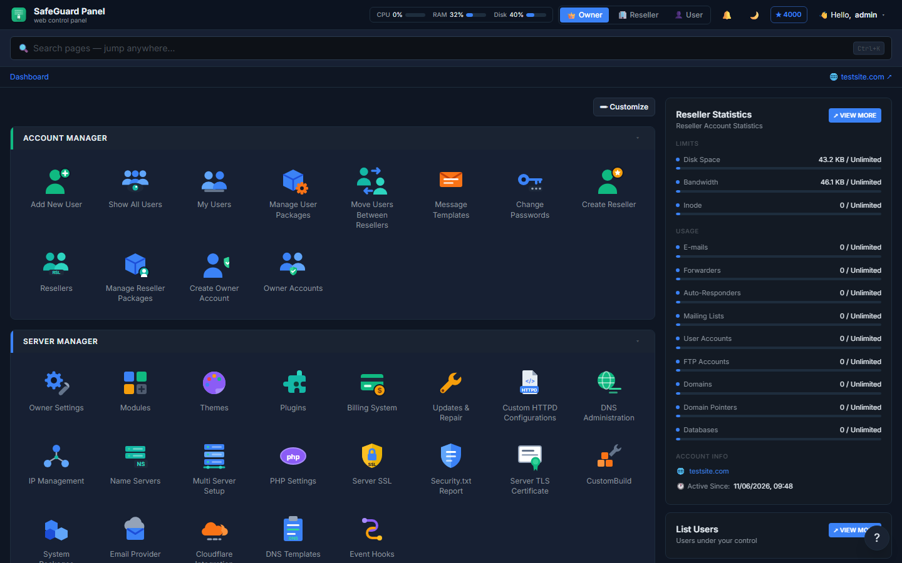

<table>
<tr>
<td width="50%"><b>🔐 Security engine</b><br>Switch between ImunifyAV, Imunify360 and Fail2Ban — CSF always on.<br><br>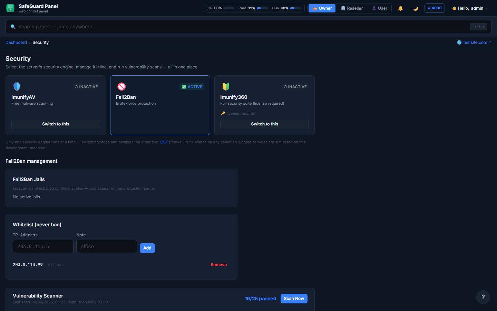</td>
<td width="50%"><b>⭐ Security Advisor</b><br>A 5000-point rating across 13 categories with one-click fixes and history.<br><br>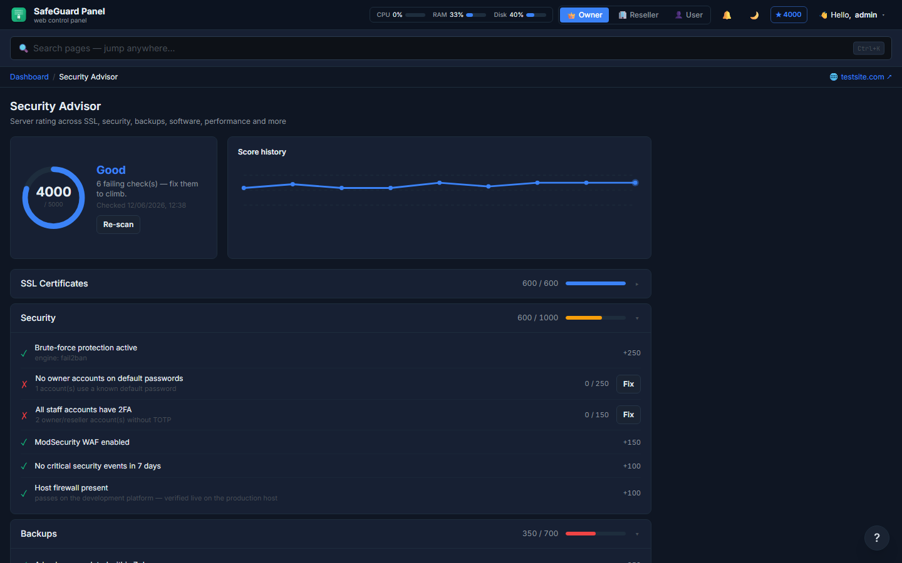</td>
</tr>
<tr>
<td width="50%"><b>🎨 Themes</b><br>Six real panel shells, each with light + dark variants.<br><br>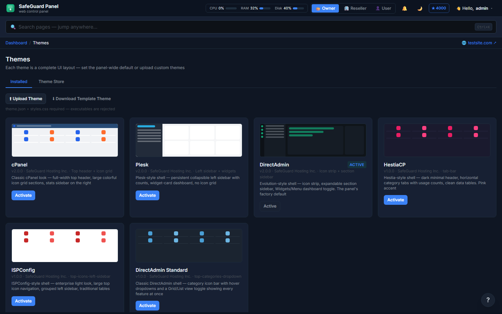</td>
<td width="50%"><b>🏷️ White-label branding</b><br>Name, colors, every logo asset, and a words-or-pictures logo toggle.<br><br>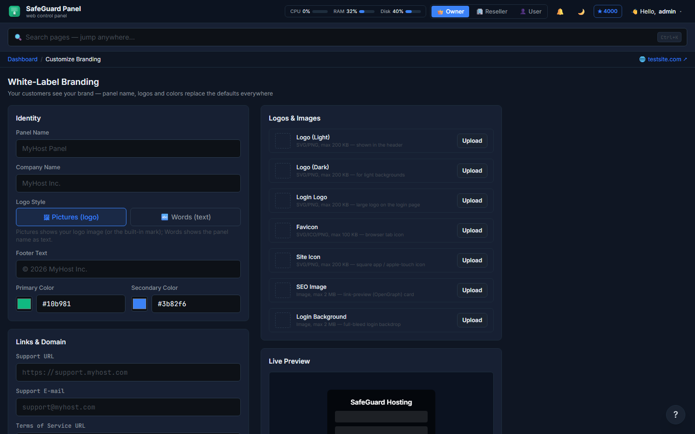</td>
</tr>
<tr>
<td width="50%"><b>🧰 WordPress Toolkit</b><br>Plesk-class management with live preview thumbnails.<br><br>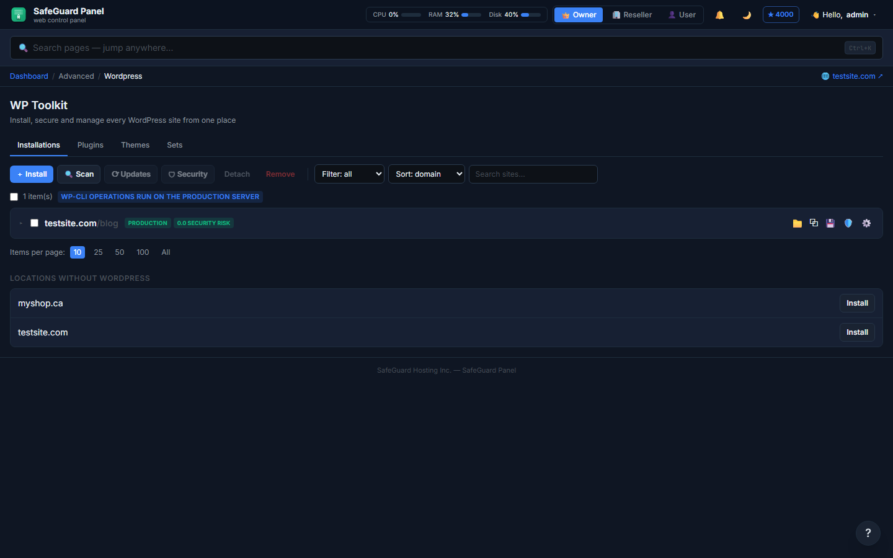</td>
<td width="50%"><b>📦 1-click installer</b><br>Searchable app catalog with category filters.<br><br>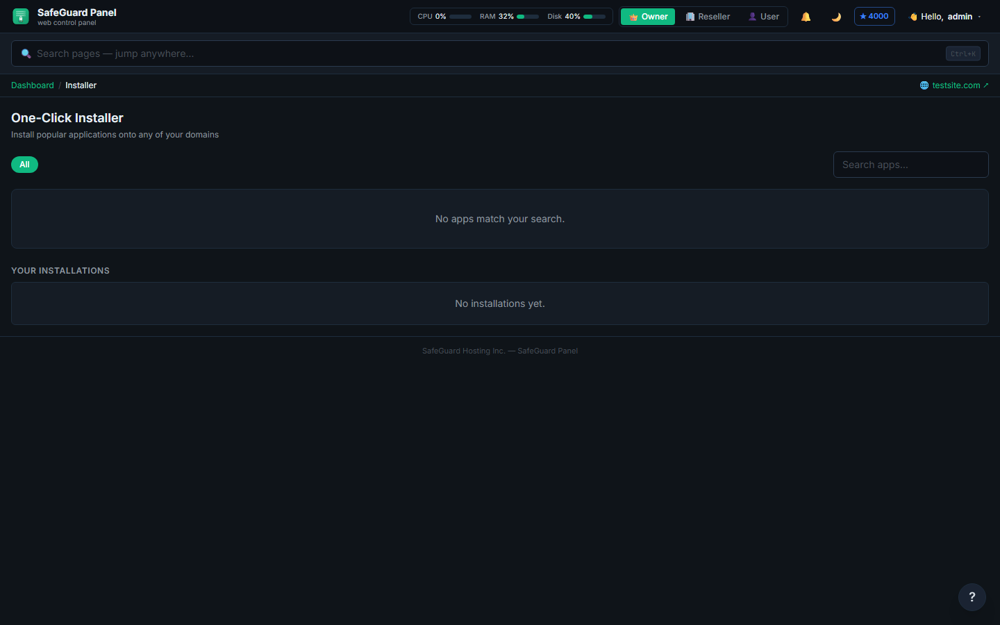</td>
</tr>
</table>

<div align="center">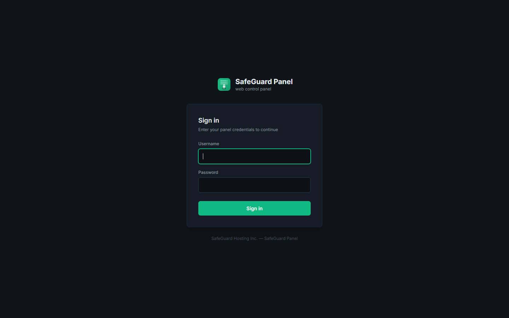</div>

---

## ⚔️ How it compares

> **Honest footing:** SafeGuard Panel is new and pre-1.0. It doesn't have the decade-plus
> production track record or third-party ecosystem of cPanel or Plesk — yet. It competes on a
> **modern stack, a free price, security-first engineering, and built-in features that cost
> extra (or don't exist) elsewhere.**

### The landscape at a glance

| Panel | Price | Source | Core stack | Email | Reseller / white-label | Niche |
|---|---|---|---|---|---|---|
| **🛡️ SafeGuard Panel** | **Free** | Closed (freeware) | **Go + React** | Pluggable (no local daemon) | ✅ Full | Modern, security-first, white-label |
| cPanel & WHM | 💸💸💸 per-account | Closed | Perl / C++ | Built-in (Exim/Dovecot) | ✅ (white-label add-on) | The industry standard |
| Plesk | 💸💸 tiered | Closed | PHP | Built-in | ✅ | Linux **+ Windows** |
| DirectAdmin | 💸 cheap tiers | Closed | C++ / scripts | Built-in | ✅ | Lightweight veteran |
| CloudPanel | **Free** | Closed (freeware) | PHP/Symfony + Node | ❌ none | 🟡 limited | Cloud / PHP-app hosting, NGINX-only |
| Virtualmin | Free + Pro | **Open (GPL)** | Perl (Webmin) | Built-in | ✅ | Webmin-based, mature |
| CyberPanel | Free + Ent | **Open (GPL)** | Python/Django | Built-in | 🟡 | OpenLiteSpeed; notable CVE history |
| HestiaCP | **Free** | **Open (GPL3)** | Bash / PHP | Built-in | 🟡 | VestaCP successor, community-run |
| ISPConfig | **Free** | **Open (BSD)** | PHP | Built-in | ✅ multi-server | Multi-server, dated UI |
| aaPanel | **Free** | Closed (freeware) | Python | Plugin | 🟡 | Popular; phone-home/privacy concerns |
| CWP (CentOS Web Panel) | Free + Pro | Closed | PHP / Bash | Built-in | ✅ | EL/Alma focused |
| Enhance | 💸💸 per server | Closed | — | Built-in | ✅ multi-server | Modern multi-server challenger |

### Feature matrix

| Feature | **SafeGuard** | cPanel | Plesk | DirectAdmin | CloudPanel | CyberPanel | HestiaCP | ISPConfig | aaPanel |
|---|:---:|:---:|:---:|:---:|:---:|:---:|:---:|:---:|:---:|
| **Free to run** | 🟢 | 🔴 | 🔴 | 🔴 | 🟢 | 🟢 | 🟢 | 🟢 | 🟢 |
| Multiple UI shells | 🟢 **6** | 🔴 1 | 🟡 2 | 🟡 2 | 🔴 1 | 🔴 1 | 🔴 1 | 🔴 1 | 🔴 1 |
| Full white-label (logo/favicon/SEO) | 🟢 | 🟡 add-on | 🟡 | 🟡 | 🔴 | 🔴 | 🟡 | 🟡 | 🔴 |
| Owner→Reseller→User RBAC | 🟢 | 🟢 | 🟢 | 🟢 | 🔴 | 🟡 | 🟡 | 🟢 | 🟡 |
| Built-in website builder | 🟢 Wix-class | 🟡 add-on | 🟡 add-on | 🔴 | 🔴 | 🔴 | 🔴 | 🔴 | 🔴 |
| WordPress toolkit | 🟢 | 🟢 | 🟢 | 🟡 | 🟡 | 🟡 | 🟡 | 🔴 | 🟢 |
| Security engine choice (AV/360/F2B+CSF) | 🟢 | 🟡 | 🟡 | 🟡 | 🟡 | 🟡 | 🟡 | 🟡 | 🟡 |
| Encrypted off-site backups | 🟢 B2+AES | 🟡 | 🟢 | 🟡 | 🟡 | 🟡 | 🟡 | 🟡 | 🟡 |
| Multi-provider email (no local daemon) | 🟢 | 🔴 | 🔴 | 🔴 | n/a | 🔴 | 🔴 | 🔴 | 🔴 |
| Single static binary | 🟢 | 🔴 | 🔴 | 🔴 | 🔴 | 🔴 | 🔴 | 🔴 | 🔴 |
| Standalone repair server | 🟢 | 🔴 | 🔴 | 🔴 | 🔴 | 🔴 | 🔴 | 🔴 | 🔴 |
| Modern UI (dark mode, Ctrl-K, widgets) | 🟢 | 🟡 | 🟢 | 🟡 | 🟢 | 🟡 | 🟡 | 🔴 | 🟡 |

<sub>🟢 first-class · 🟡 partial / add-on / paid tier · 🔴 not available. Competitor details are best-effort and change with each release — corrections welcome via an issue.</sub>

---

## 🏗️ Architecture

One binary in the middle. Everything else is the battle-tested stack you already trust.

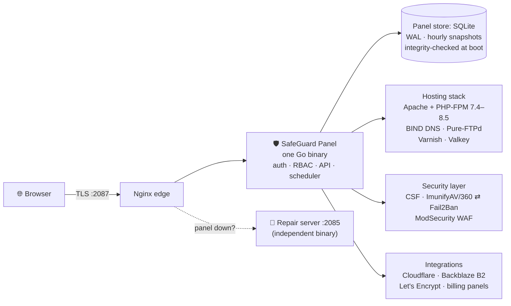

- **The panel never serves customer traffic** — sites run on the standard Nginx/Apache/PHP-FPM path even if the panel is stopped.
- **The repair server is a second, independent binary**: if the panel ever breaks, `/repair` still answers, runs diagnostics, fixes permissions and restarts services.
- **Per-domain PHP-FPM pools + jailed user homes** isolate every customer; the panel's own tools run on a private PHP build customers can't touch.

---

## 🔒 Security

Security isn't a feature here — it's the foundation. Full inventory and the go-live
checklist live in **[SECURITY.md](SECURITY.md)**. Highlights:

- 🧪 **Pentested in-house** — JWT forgery, IDOR, SQLi, path traversal, SSRF, XSS, mass-assignment, brute-force, CORS and header-bypass suites all pass clean.
- 🛡️ **Immune to the CyberPanel mass-compromise classes** — auth middleware wraps the whole router; argv-style exec everywhere (no shell); no auth-bypass via path normalization.
- 🔑 **Defense in depth** — HS256 JWT with live-session checks, TOTP 2FA, per-user IP allow-lists, support keys, bcrypt + pepper, AES-256-GCM secrets at rest.
- 🧱 **Hardened edge** — strict CSP/HSTS/XFO, body limits, global + login rate limits with lockout tiers, CSRF double-submit, proxy-aware client IPs.
- 📦 **Clean dependencies** — `govulncheck` **0** vulnerabilities (code *and* modules), `npm audit` **0**.
- ⭐ **Built-in Security Advisor** — a 5000-point server rating across 13 categories with one-click fixes, plus a 26-check vulnerability scanner.

---

## 🚀 Install on AlmaLinux 9

One command on a fresh **AlmaLinux / Rocky / CloudLinux 9** box — runs on **1 vCPU / 1 GB RAM / 10 GB disk**, with 2 GB / 20 GB recommended once you're hosting real sites (add more for the optional Imunify360 + ClamAV agents):

```sh
curl -sSL https://install.safeguardpanel.ca | sudo bash
```

…or install offline / air-gapped from the official self-contained release
bundle (downloadable from [safeguardpanel.ca](https://safeguardpanel.ca);
every file in it is SHA256-verified by the installer):

```sh
scp -r safeguard-release root@SERVER:/root/safeguard-release
ssh root@SERVER 'SAFEGUARD_DOWNLOAD_BASE=file:///root/safeguard-release \
    bash /root/safeguard-release/install.sh'
```

The installer provisions the whole stack (Nginx, Apache, PHP-FPM 7.4–8.5, MariaDB,
PostgreSQL, BIND, Valkey, Varnish, Pure-FTPd, certbot, CSF, ImunifyAV), creates the
systemd services, terminates TLS on port **2087**, and prints your generated admin
password. A standalone repair server keeps `/repair` reachable even if the panel is down.

**Your first login finishes the job visually**: the panel forces a new admin
password, then a guided **setup wizard** walks through nameservers, the security
engine and encrypted off-site backups — every step skippable and editable later,
and the Security Advisor flags anything you leave unconfigured.

### 💳 Hook up your billing panel (optional)

Selling hosting through WHMCS, Blesta, FOSSBilling or another billing system?
Connect it so paid orders auto-provision accounts:

1. In SafeGuard Panel: **Owner → Billing System → Provisioning API Key → Generate Key**.
2. Install the ready-made module for your platform from
   **[`billing_integrations/`](billing_integrations/)** — one folder per platform
   (WHMCS, Blesta, HostBill, ClientExec, FOSSBilling, BoxBilling, Paymenter,
   BillingServ), each with its required file structure and step-by-step README.
3. No module for your platform? The same folder documents the six generic REST
   hooks (`/api/billing/*`) any billing system can call directly.

---

## 🧾 Licensing — actually free. Here's exactly how.

GitHub can't auto-classify our license because it's custom, so in plain English:

| Question | Answer |
|---|---|
| 💵 What does it cost? | **Nothing.** Not per account, not per server, not per domain. |
| 🏢 Commercial hosting allowed? | **Yes** — run a hosting company on it, sell reseller hosting, white-label it to your customers. Charging for *hosting services* is always free use. |
| 🔢 Server / account limits? | **None.** |
| 🪪 Registration / license key required? | **No.** Install and go. |
| 🔓 Is it open source? | **No.** Free to *use*, closed source. (Like CloudPanel or aaPanel.) |
| 💼 Can I sell or redistribute the **panel itself**? | **Only with a license from us.** Bundling, repackaging, server images/appliances, marketplace offerings, or any rebranded panel *product* require a written redistribution/OEM license first — **support@safeguardpanel.ca** (LICENSE §11). |
| 🚫 What else can't I do? | Modify or reverse-engineer the panel, or strip the built-in notices outside the white-label features. |
| 📃 The fine print? | One readable file: **[LICENSE](LICENSE)** — Free-Use EULA, governed by Alberta, Canada law. |

> 🧭 **The line in one sentence:** selling *hosting powered by* SafeGuard Panel = free, forever.
> Selling *SafeGuard Panel* = talk to us first.

**Why closed source?** We sell *services*, not software — and we'd rather competitors
not ship our panel with their sticker on it. The trade we offer instead: in-house
pentesting, a public [security policy](SECURITY.md), zero telemetry, and the no-gimmicks
promise above.

---

## ☁️ Don't want the headache? We'll run it for you.

The panel is free either way — these exist for teams that want someone on call:

- 🤝 **Support licenses** — priority help from the people who wrote the panel: installs, migrations, tuning, 24/7 incident response.
- ☁️ **SafeGuard Managed Hosting** — we provision, secure, patch, monitor and back up your servers. You get the same panel, plus our team behind it.
- 💼 **Redistribution / OEM licensing** — want to ship SafeGuard Panel inside your own product, server image or marketplace offering? That's the one thing that needs a written license from us first ([LICENSE §11](LICENSE)) — email us and we'll work out terms.

📬 **support@safeguardpanel.ca** · 🌐 **[safeguardpanel.ca](https://safeguardpanel.ca)**

---

## ❓ FAQ

<details>
<summary><b>Is "free" really free? What's the catch?</b></summary>
<br>
No catch. Every feature, unlimited everything, $0, forever — see <a href="#-our-promise--no-gimmicks-no-tricks">the promise</a>.
We make money only from optional support licenses, managed hosting, and redistribution/OEM licensing.
</details>

<details>
<summary><b>I run a hosting company / sell reseller hosting — do I need a license?</b></summary>
<br>
<b>No.</b> Using the panel to host and charge your own customers — including selling white-labeled
reseller hosting accounts on your servers — is exactly what the free license covers. The only thing
that requires a license from us is selling or redistributing <i>the panel software itself</i>:
bundling it into a product, shipping it in server images or appliances, listing it on a marketplace,
or offering it as a rebranded panel. If that's your plan, email
<b>support@safeguardpanel.ca</b> first and we'll set up a redistribution/OEM agreement (LICENSE §11).
</details>

<details>
<summary><b>Can I migrate from cPanel / Plesk / DirectAdmin?</b></summary>
<br>
Yes — the built-in Migration Wizard scans backups from <b>10 panels</b> (cPanel, DirectAdmin,
Plesk, HestiaCP, CyberPanel, Virtualmin, ISPConfig, aaPanel and more) and imports accounts,
domains, files and databases. SSH pull migration is included for live servers.
</details>

<details>
<summary><b>Why doesn't it run a mail server?</b></summary>
<br>
Deliberate design: a panel box running Exim/Dovecot is the #1 source of blacklisted IPs and
compromise. SafeGuard manages email <i>DNS + provisioning</i> through pluggable providers
(SafeGuard Mail, Google Workspace, Microsoft 365, or any external server) so your web server
stays a web server.
</details>

<details>
<summary><b>Does it work with my billing system?</b></summary>
<br>
Eight platforms are built in — WHMCS, Blesta, HostBill, ClientExec, FOSSBilling, BoxBilling,
Paymenter, BillingServ — and <a href="billing_integrations/"><code>billing_integrations/</code></a>
ships a ready-made provisioning module for each, every one with its own install README.
Anything else can call the generic REST hooks (<code>/api/billing/*</code>) directly.
</details>

<details>
<summary><b>What happens if the panel itself breaks?</b></summary>
<br>
A <b>standalone repair server</b> (separate binary, port 2085) stays up independently:
it runs DB/config/permission/service diagnostics, restarts the panel, and serves a
neutral error page with auto-retry. Your customers' sites never depended on the panel
to begin with.
</details>

<details>
<summary><b>Which OSes are supported?</b></summary>
<br>
AlmaLinux 9 first-class (Rocky/CloudLinux 9 compatible). That focus is deliberate —
one hardened target instead of ten half-tested ones.
</details>

---

## 🗺️ Roadmap

SafeGuard Panel is feature-complete and in pre-1.0 hardening. What's next:

- 🧪 **External validation** — independent pentest on a live AlmaLinux host, SSL Labs / Mozilla Observatory, public disclosure program
- 🐧 **Wider OS support** — Ubuntu LTS alongside AlmaLinux/Rocky/CloudLinux
- 🧩 **Plugin & theme marketplace** — install community add-ons and skins in a click
- 🛍️ **More billing modules** — round out the `billing_integrations/` set from reference to fully verified
- 🌍 **Translations** — the i18n scaffold is in; community language packs welcome

Found a bug or want a feature? **[Open an issue](../../issues)** — and ⭐ the repo to follow along.

---

## 🤝 Contributing & support

- 🐛 **Bugs / features** → [GitHub issues](../../issues)
- 🔐 **Security reports** → see **[SECURITY.md](SECURITY.md)** (please disclose responsibly)
- 💬 **Questions / commercial support** → support@safeguardpanel.ca

---

## 🧑‍💻 Development

**Backend** (Go 1.25+, listens on `:2087`):

```sh
cd backend
go run ./cmd/server
```

Env: `PORT` (2087), `DB_PATH`, `JWT_SECRET`, `CORS_ORIGIN` (http://localhost:5173),
`ADMIN_PASSWORD` (seed password, default `admin123!`).

**Frontend** (Vite on `:5173`, proxies `/api` → `:2087`):

```sh
cd frontend
npm install
npm run dev
```

**Dev login:** `admin` / `admin123!` (seeded on first run).

---

## 🧱 Tech stack

| Layer | Choice |
|---|---|
| **Backend** | Go 1.25 standard library — `net/http` pattern router, zero web frameworks |
| **Panel store** | SQLite (dev **and** prod — pure-Go driver, WAL, single writer, hourly snapshots, boot integrity check + auto-restore, daily encrypted off-site copy). Same class of choice as CloudPanel; it's a sub-MB config store, not a workload database |
| **Customer databases** | MariaDB & PostgreSQL — one shared instance of each, per-database grant isolation, phpMyAdmin/pgAdmin SSO |
| **Frontend** | React 18 + TypeScript + Vite + TailwindCSS |
| **Auth** | JWT (HS256, 24h) with live-session revocation + optional TOTP 2FA |
| **Web stack** | Nginx (edge) · Apache + PHP-FPM (per-domain pools) · Varnish → Nginx → Valkey → OPcache |
| **DNS / SSL** | BIND + optional Cloudflare sync · certbot / Let's Encrypt, wildcard DNS-01 |
| **Backups** | Backblaze B2 (S3-compatible), AES-256-GCM encrypted |
| **Target OS** | AlmaLinux 9 (CloudLinux-ready) |

---

<div align="center">

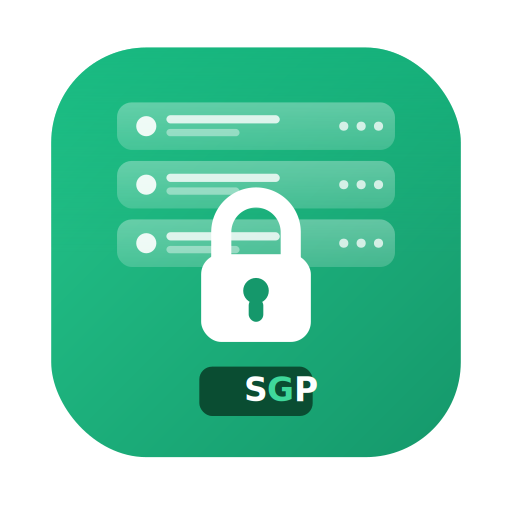

**If SafeGuard Panel looks like the panel you've been waiting for — ⭐ star the repo and spread the word.**

© 2026 SafeGuard Hosting Inc. All rights reserved. Free to use — see [LICENSE](LICENSE).

</div>
